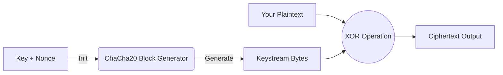

# ChaCha20 Implementation in C

A lightweight, zero-dependency implementation of the **ChaCha20 stream cipher** (RFC 8439) written in C99.

This library is designed for portability and ease of integration, featuring a context-based API that supports streaming encryption for large files or network packets.

## 🚀 Features

* **Standard Compliant:** Fully implements the IETF variant of ChaCha20 (RFC 8439).
* **Zero Dependencies:** Written in pure C99 using only standard headers (`stdint.h`, `stdio.h`, `stddef.h`).
* **Streaming API:** Can process data in chunks of any size using a stateful context.
* **Portable:** Endianness-neutral implementation (handles Little Endian conversion internally).

## 📊 How it Works

ChaCha20 is a stream cipher. It generates a "Keystream" of random bytes based on your Key and Nonce, and then combines it with your message.



## 📂 Project Structure

```text
.
├── src/
│   ├── chacha.c                    # Implementation logic (Hidden from user)
│   └── chacha.h                    # Public API header
├── tests/                          # Test vectors and binary files
│   ├── plaintext.bin               # Input: RFC 8439 "Sunscreen" text
│   ├── ciphertext.bin              # Output: Result of encrypting plaintext.bin
│   ├── reverse_ciphertext.bin      # Input: A ciphertext file to test decryption
│   └── reverse_plaintext.bin       # Output: Result of decrypting (should match original text)
├── main.c                          # Example Usage & Test Runner
├── Makefile                        # Build configuration
├── README.md
└── .gitignore
```

## 💻 Library API Usage
If you want to integrate this library into your own project, the API is simple:

```c
#include "src/chacha.h"

// 1. Initialize
chacha20_ctx ctx;
chacha20_init(&ctx, key, counter, nonce);

// 2. Encrypt (or Decrypt)
// 'in' and 'out' can be the same buffer for in-place encryption
chacha20_update(&ctx, input_buffer, output_buffer, length);

// 3. Wipe sensitive state
chacha20_wipe(&ctx);
```

## 🛠️ Build & Run
Use the provided Makefile to compile the project.

```bash
# 1. Compile the project
make

# 2. Run the program
./chacha20

# 3. Clean build files
make clean
```
*Note:* Ensure you have `gcc` and `make` installed. Windows users can use `mingw32-make`.

## 🧪 Testing & Validation
### 1. **Encryption Test**

The `tests/` folder contains the "Sunscreen" example data directly from the RFC standard in `plaintext.bin`.
By default, `main.c` reads this file and generates `tests/ciphertext.bin`.

To verify correctness, compare your output against the official RFC hex sequence:

**Expected Result (RFC 8439)**

Your output must match this sequence exactly:

```bash
Ciphertext (Hex)
000  e4 e7 9c 59 52 28 34 7e 38 44 96 88 34 26 4e 6d
010  b6 52 75 86 e5 bb 06 85 d9 43 7f 8d 66 0a 31 22
020  2e 5a d4 13 07 68 ac 65 39 5d 6b 4b 04 e8 30 95
030  8b 4a 07 45 e6 76 9d 96 1b 14 0d 10 78 48 20 1e
040  0c 8e 28 6a 80 94 7e 12 1d 79 5d 18 1a b6 44 2d
050  2e 63 76 17 33 89 26 3e 1d 87 2e 20 3c 75 0c 9c
060  d9 66 7c 28 1b 48 55 4e 33 1b 31 2a 74 8a 63 74
070  43 1d 7f
```

### 2. **Decryption Test**

To test the reverse process (decrypting a file):

- Open `main.c`;
- Modify the file paths to read `tests/reverse_ciphertext.bin` and write to `tests/reverse_plaintext.bin`;
- Recompile and run.
- The output `reverse_plaintext.bin` should match the original plaintext message.

*Recommended:* Use a Hex Editor (like HxD) or `hexdump` to view the binary files.

## 📜 References
[RFC 8439 - ChaCha20 and Poly1305 for IETF Protocols](https://www.rfc-editor.org/rfc/rfc8439.html)

## 📄 License
This project is open-source and available under the MIT License.