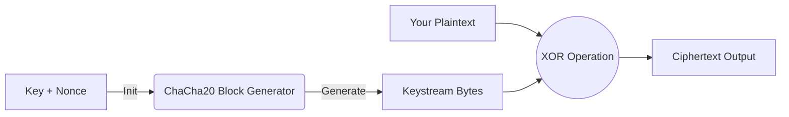

# ChaCha20 Implementation in C

A lightweight, zero-dependency implementation of the **ChaCha20 stream cipher** (RFC 8439) written in C99.

This library is designed for portability and ease of integration, featuring a context-based API that supports streaming encryption for large files or network packets.

## 🚀 Features

* **Standard Compliant:** Fully implements the IETF variant of ChaCha20 (RFC 8439).
* **Zero Dependencies:** Written in pure C99 using only standard headers (`stdint.h`, `stdio.h`, `stddef.h`).
* **Streaming API:** Can process data in chunks of any size using a stateful context.
* **Portable:** Endianness-neutral implementation (handles Little Endian conversion internally).

## 📊 How it Works

ChaCha20 is a stream cipher. It generates a "Keystream" of random bytes based on your Key and Nonce, and then combines it with your message.



## 📂 Project Structure

```text
.
├── src/
│   ├── chacha.c                    # Implementation logic (Hidden from user)
│   └── chacha.h                    # Public API header
├── tests/                          # Test vectors and binary files
│   ├── plaintext.bin               # Input: RFC 8439 "Sunscreen" text
│   ├── ciphertext.bin              # Output: Result of encrypting plaintext.bin
│   ├── reverse_ciphertext.bin      # Input: A ciphertext file to test decryption
│   └── reverse_plaintext.bin       # Output: Result of decrypting (should match original text)
├── main.c                          # Example Usage & Test Runner
├── Makefile                        # Build configuration
├── README.md
└── .gitignore
```

## 💻 Library API Usage
If you want to integrate this library into your own project, the API is simple:

```c
#include "src/chacha.h"

// 1. Initialize
chacha20_ctx ctx;
chacha20_init(&ctx, key, counter, nonce);

// 2. Encrypt (or Decrypt)
// 'in' and 'out' can be the same buffer for in-place encryption
chacha20_update(&ctx, input_buffer, output_buffer, length);

// 3. Wipe sensitive state
chacha20_wipe(&ctx);
```

## 🛠️ Build & Run
Use the provided Makefile to compile the project.

```bash
# 1. Compile the project
make

# 2. Run the program
./chacha20

# 3. Clean build files
make clean
```
*Note:* Ensure you have `gcc` and `make` installed. Windows users can use `mingw32-make`.

## 🧪 Testing & Validation
### 1. **Encryption Test**

The `tests/` folder contains the "Sunscreen" example data directly from the RFC standard (**section 2.4.2**) in `plaintext.bin`.
By default, `main.c` reads this file and generates `tests/ciphertext.bin`.

To verify correctness, compare your output against the official RFC hex sequence:

**Expected Result (RFC 8439)**

Your output must match this sequence exactly:

```text
Ciphertext (Hex)
000  6e 2e 35 9a 25 68 f9 80 41 ba 07 28 dd 0d 69 81
010  e9 7e 7a ec 1d 43 60 c2 0a 27 af cc fd 9f ae 0b
020  f9 1b 65 c5 52 47 33 ab 8f 59 3d ab cd 62 b3 57
030  16 39 d6 24 e6 51 52 ab 8f 53 0c 35 9f 08 61 d8
040  07 ca 0d bf 50 0d 6a 61 56 a3 8e 08 8a 22 b6 5e
050  52 bc 51 4d 16 cc f8 06 81 8c e9 1a b7 79 37 36
060  5a f9 0b bf 74 a3 5b e6 b4 0b 8e ed f2 78 5e 42
070  87 4d
```

### 2. **Decryption Test**

To test the reverse process (decrypting a file):

- Open `main.c`;
- Modify the file paths to read `tests/reverse_ciphertext.bin` and write to `tests/reverse_plaintext.bin`;
- Recompile and run.
- The output `reverse_plaintext.bin` should match the original plaintext message.

*Recommended:* Use a Hex Editor (like HxD) or `hexdump` to view the binary files.

## 📜 References
[RFC 8439 - ChaCha20 and Poly1305 for IETF Protocols](https://www.rfc-editor.org/rfc/rfc8439.html)

## 📄 License
This project is open-source and available under the MIT License.
